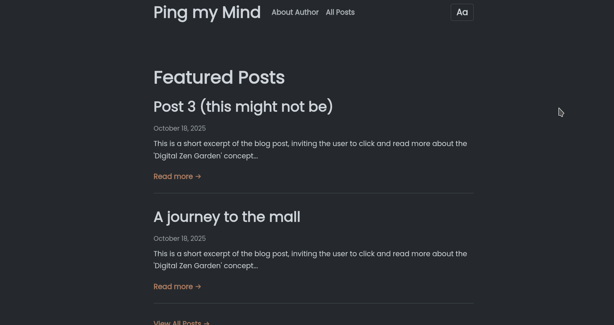

# Ping my Mind - A Minimal Eleventy Blog



This is a clean, minimal, and responsive personal blog built with [Eleventy (11ty)](https://www.11ty.dev/). It is designed for a comfortable reading experience and includes a built-in appearance switcher and a pre-configured CMS for easy posting.

**Live Site:** [pingmymind.netlify.app](https://pingmymind.netlify.app/)

## Features

* **Static & Fast:** Built with Eleventy for top-tier performance and security.
* **Appearance Toggle:**
    * **Color Themes:** Light, Sepia, and Dark modes.
    * **Font Styles:** Sans-Serif, Serif, and Accessible (Atkinson Hyperlegible) font options.
* **User Preferences:** Remembers the user's theme and font choices in `localStorage`.
* **CMS Integrated:** Pre-configured with [Decap CMS](https://decapcms.org/) (formerly Netlify CMS) for a simple, GUI-based admin panel to write and manage posts.
* **Featured Posts:** Easily feature posts on the homepage by adding a `featured` tag in the post's front matter.
* **Responsive Design:** Scales gracefully from mobile phones to desktops.

## Technology Stack

* **[Eleventy (11ty)](https://www.11ty.dev/)**: The static site generator.
* **[Nunjucks](https://mozilla.github.io/nunjucks/)**: The templating language used for layouts.
* **[Decap CMS](https://decapcms.org/)**: A Git-based content management system for easy post editing.
* **Markdown**: For writing blog posts.
* **CSS**: For styling, using CSS variables for easy theming.
* **JavaScript**: For handling the appearance modal and saving user preferences.

## Getting Started

### Prerequisites

You must have [Node.js](https://nodejs.org/) (which includes `npm`) installed on your machine.

### Installation

1.  Clone this repository to your local machine.
2.  Navigate into the project directory (e.g., `cd Geem_b`).
3.  Install the project dependencies:
    ```sh
    npm install
    ```

### Running the Project

**1. Build the Site**

To run a single build and generate the final site in the `_site/` folder, run the `start` script:

```sh
npm start
````

**2. Run the Local Development Server**

To build the site and run a local server with hot-reloading (which automatically rebuilds when you save a file), run this command:

```sh
npx @11ty/eleventy --serve
```

This will serve your site locally, usually at `http://localhost:8080`.

## How It Works

### Theme & Font Switching

The appearance switcher is controlled by `Geem_b/script.js`.

1.  When a user clicks a theme or font button, a `data-theme` or `data-font` attribute is read.
2.  A class (e.g., `theme-dark`, `font-serif`) is applied to the `<body>` tag.
3.  The user's choice is saved to `localStorage` so it persists on their next visit.
4.  The CSS in `Geem_b/style.css` uses CSS variables defined under these body classes to change the site's colors and fonts instantly.

### Featured Posts

The homepage (`Geem_b/index.njk`) displays a list of "Featured Posts". This is automatically populated by Eleventy by looking for any post with the tag `featured`.

To add a post to this list, simply add `"featured"` to the `tags` array in the post's Markdown front matter.

**Example (`posts/my-post.md`):**

```yaml
---
title: "My New Post"
layout: "_indvposts.njk"
date: "2025-10-26"
tags: 
 - "post"
 - "featured"  <-- This tag makes it a featured post
---

This is the content of my post...
```

## CMS / Admin Panel

This project is ready to be deployed to [Netlify](https://www.netlify.com/) and includes a pre-configured admin panel using Decap CMS.

  * **Configuration:** The CMS is configured in `Geem_b/admin/config.yml`. It's set up to manage a "Blog" collection located in the `posts` folder.
  * **Netlify Identity:** The `Geem_b/admin/index.html` and `Geem_b/_includes/base.njk` files include the scripts for Netlify Identity, which is required for CMS authentication.
  * **Accessing:** Once deployed, you can access the admin panel by navigating to `[your-site-url]/admin/`.

## Project Structure

```
.
├── admin/
│   ├── config.yml      # Decap (Netlify) CMS configuration
│   └── index.html      # The entry point for the CMS admin panel
├── _includes/
│   ├── base.njk        # The main site template (header, footer, nav)
│   └── _indvposts.njk  # The layout for individual blog posts
├── posts/
│   ├── post1.md        # Blog posts in Markdown
│   └── ...
├── _site/              # The final, built static site (this is what's deployed)
├── images/
│   └── image.png       # Uploaded images (as configured in config.yml)
├── about_me.md         # The content for the "About" page
├── blog.njk            # Template for the "All Posts" page
├── index.njk           # Template for the Homepage (Featured Posts)
├── package.json        # Project dependencies and scripts
├── script.js           # JavaScript for theme/font switching
└── style.css           # All styles for the blog
```